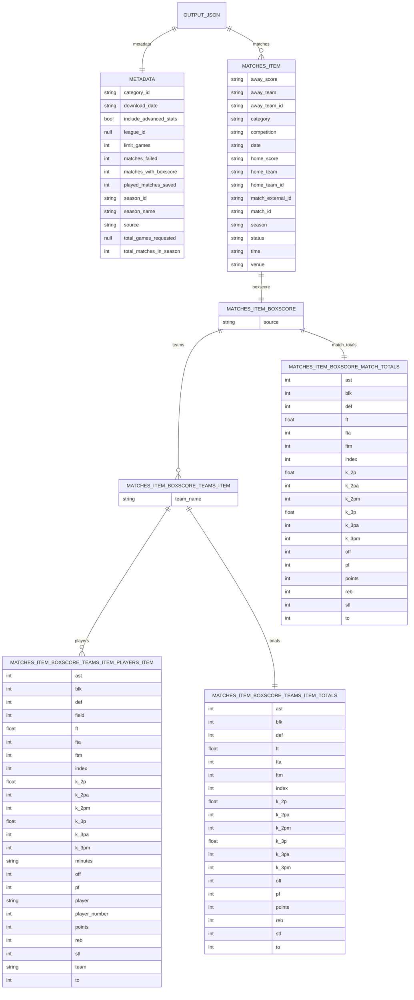

# KorisAPI

Create datasets from Basket.fi data with a Python command line tool or view statistics with a Textual TUI app.

## Features

- **CLI Tool**: Download match data, team information, and detailed statistics
- **Interactive TUI**: Browse matches, teams, and player statistics in a beautiful terminal interface
- **Basket.fi API**: Access team, league, and match data from Basket.fi with API requests
- **Advanced Stats**: Fetch detailed box scores and player stats from Genius Sports through HTML parsing
- **Multiple Export Formats**: Export data to JSON, CSV, or Excel
- **Concurrent Downloads**: Fast batch requests with parallel processing

## Installation

This project uses `uv` to build and run. Install `uv` for MacOS:

```bash
curl -LsSf https://astral.sh/uv/install.sh | sh
```

or Windows:

```bash
powershell -ExecutionPolicy ByPass -c "irm https://astral.sh/uv/install.ps1 | iex"
```

After `uv` is installed, install the project by:

```bash
git clone https://github.com/apmnt/koris-api.git
cd koris-api
uv pip install -e ".[dev]"
```

## CLI Usage

Use the `koris-api` command with different actions. Run the help command to display all options:

```bash
uv run koris-api --help
```

Examples:

```bash
# Season data with advanced box scores, play-by-play and shot chart coordinates
uv run koris-api season 2 huki2526 --box-score --playbyplay --shot-chart --output-dir output/1divA_huki2526

# Single match shot chart only
uv run koris-api match 2844823 --shot-chart --output-dir output
```

## JSON Output Structure

Below is the full key layout for the sample output file in `eda/data/season_boxscores/korisliiga_2024-2025_sample.json` (generated by `scripts/json_to_mermaid.py`).



## TUI Usage

Launch the interactive terminal user interface to browse matches, teams, and statistics. The TUI provides an interface for viewing and exporting game data.

### Starting the TUI

```bash
uv run koris-tui
```

## Python API Usage

You can also use KorisAPI directly in your Python code:

```python
from koris_api import KorisAPI

# Get all matches for a competition
matches = KorisAPI.get_matches(
    competition_id="huki2526",
    category_id="4"
)

# Get team information
team = KorisAPI.get_team(team_id="12345")

# Get match details
match = KorisAPI.get_match(match_id="2701885")

# Get advanced box score
boxscore = KorisAPI.get_match_boxscore(match_id="2701885")

# Get category information with seasons
category = KorisAPI.get_category(
    competition_id="huki2526",
    category_id="4"
)
```

## Dependencies:

- `requests`: HTTP client
- `textual`: TUI framework
- `pandas`: Data manipulation
- `openpyxl`: Excel file support
- `beautifulsoup4`: HTML parsing
- `lxml`: XML/HTML parser
- `tqdm`: Progress bars
